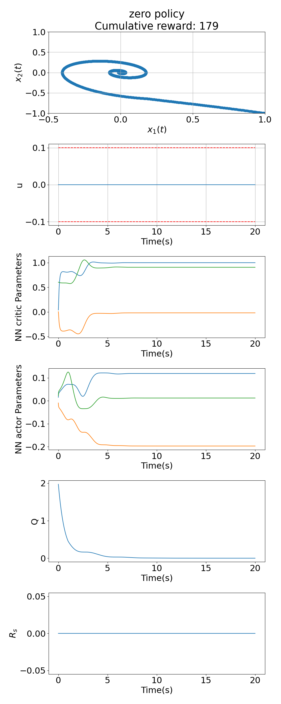
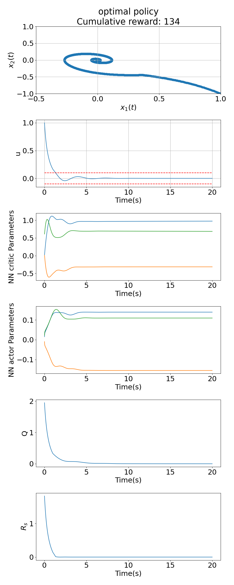
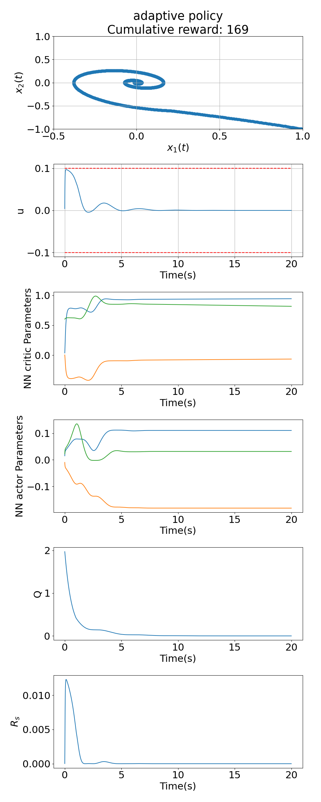
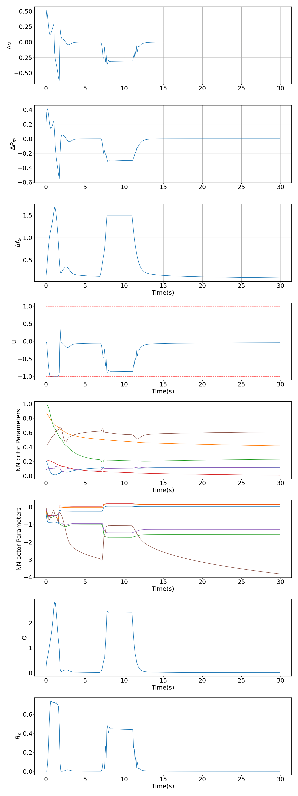

# Asymptotically Stable Adaptive–Optimal Control Algorithm With Saturating Actuators and Relaxed Persistence of Excitation

This final "Reinforcement Learning course" project focuses on the implementation of the algorithm presented in [paper](http://dx.doi.org/10.1109/TNNLS.2015.2487972)

We have implemented the algorithm and tested its performance on two environments:
* Van der Pol Oscillator
* Power Plant System

Our video-presentation can be found [here]().

## Results

**Policy** |       **Zero policy**             |  **Optimal policy**   |   **Adaptive policy***
:------------------------:|:-------------------------:|:-------------------------:|:--------------------------:|
**Van der Pol Oscillator Reward** |  **179** |  **134** | **169**
**Van der Pol Oscillator Results** |   |   | 
**Power Plant System Reward** | **Diverges** | **Not known** | **125**
**Power Plant System Results** |  |   | 

## Repository structure

- ```imgs/``` — contains experiments results
- ```supplementary/``` — contains slides in `.pdf` format
- ```actor.py``` — actor models
- ```criric.py``` — critic models
- ```environment.py``` — environments (Van der Pol Oscillator and Power Plant System)
- ```algorithm.py``` — Adaptive–Optimal Control Algorithm With
Relaxed PE
- ```experiments.py``` — starts experiments

## Installation

Follow the rows:

```
$ git clone https://github.com/Glebzok/ASAOCAwSAaRPoE.git
$ cd ASAOCAwSAaRPoE
$ python3 -m venv env
$ source env/bin/activate
$ python3 -m pip install -r requirements.txt
```

## Usage
```
usage: python3 experiments.py
```